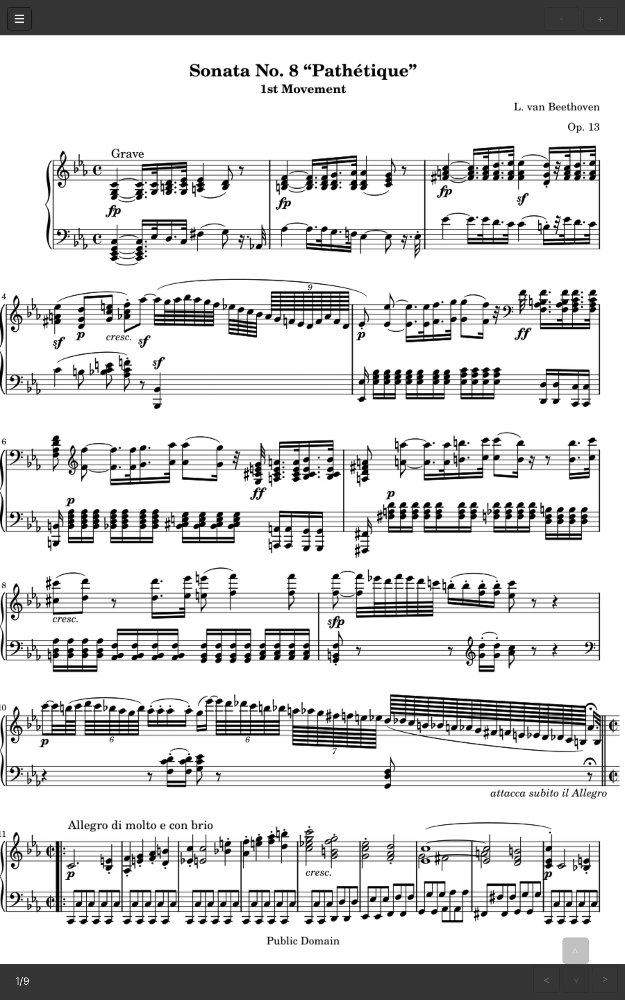

# muon-pdf

`muon-pdf` is a touchscreen-first lightweight PDF reader with fast tap/swipe page turns, made for music sheets and books on tablets.

Built for performance reading: fast page turns, zero distraction. Drag-to-move is intentionally disabled. That is the most important feature. It prevents accidental shifts and gives you confident, repeatable page flow when timing matters.

- made for tablet music-sheet and long-form PDF reading
- page-turn first design, with intentional no-drag behavior
- tap/swipe controls tuned for touchscreen use
- keyboard and mouse friendly
- ultra lightweight

**Screenshot**  
<a href="./screenshot1.png"></a>
## User Interface

### Screen Tap Zones

| Zone | Area | Behavior |
| --- | --- | --- |
| left zone | left 40% of screen | tap/click goes to previous page |
| center zone | middle 20% of screen | double tap/double click toggles fullscreen |
| right zone | right 40% of screen | tap/click goes to next page |
| corner  | all four corners, each 20% x 20% |  ignored |

### Unified Controls

| Action | touch | click | keyboard |
| --- | --- | --- | --- |
| open file | tap menu `☰`, then `Open` | click menu `☰`, then `Open` |  |
| previous page | tap left zone, swipe right/down | click left zone | `Shift+Space`, `<`, `,` |
| next page | tap right zone, swipe left/up | click right zone | `Space`, `>`, `.` |
| toggle fullscreen | double tap center 20% | double click center 20% | `f`, `F`, `F11` |
| rotate clockwise 90° | tap menu `☰`, then `Rotate` | click menu `☰`, then `Rotate` | `r`, `R` |
| zoom in | tap `+` | click `+` | `+`, `=` |
| zoom out | tap `-` | click `-` | `-`, `_` |
| pan left | tap `<` | click `<` | `Left`, `h` |
| pan right | tap `>` | click `>` | `Right`, `l` |
| pan up | tap `^` | click `^` | `Up`, `k` |
| pan down | tap `v` | click `v` | `Down`, `j` |
| quit app | tap menu `☰`, then `Quit` | click menu `☰`, then `Quit` | `q` |

## Build from source

Builds with Zig 0.15 and 0.16 (system `gtk4` and `mupdf` dev packages required).

```bash
make
./zig-out/bin/muon-pdf
```

## Install from source

```bash
make
sudo make install
```

This installs:
- `/usr/bin/muon-pdf`
- `/usr/share/applications/muon-pdf.desktop`

Set as default PDF app from CLI:

```bash
xdg-mime default muon-pdf.desktop application/pdf
```

## Run pre-built AppImage

AppImage is provided for convenience, but it is **not lightweight** compared to the native compiled build. 

If you still want the portable AppImage, download the release for your architecture (`x86_64` or `aarch64`) and run:

```bash
chmod +x muon-pdf-linux-<arch>.AppImage
./muon-pdf-linux-<arch>.AppImage
```

---

For implementation details and architecture, see [`spec.md`](./spec.md).
